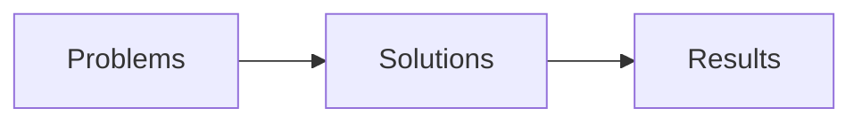

# CycodBench Command Line Interface Specification

## Introduction

CycodBench is a benchmark runner and evaluation tool for the cycod agent against SWE-bench problems.



Each item above represents a key stage in the benchmark process:
- **Problems**: The set of software engineering problems to be solved.
- **Solutions**: The candidate solutions generated by the agent for the problems.
- **Results**: The evaluation outcomes of the solutions against the problems.

### CycodBench Terminology
- **Dataset**: A collection of problems to be processed.
- **Problem**: A specific software engineering problem to be solved (specified in a dataset).
- **Solution**: A candidate solution generated by the agent for a problem.
- **Result**: The evaluation outcome of a solution against a problem (was it a successful solution, based on the evaluation criteria).
- **Container**: An isolated environment where the agent runs to solve problems.
- **`problem_id`**: A unique identifier for a problem, typically in the format `owner__repo-issue-id` (e.g., `astropy__astropy-12907`).
- **`problem_idx`**: A candidate index for the problem within a dataset, used to differentiate multiple instances of the same problem.
- **`agent_patch`**: The code patch generated by the agent to solve a problem, which may include modifications to the codebase or new files.
- **`agent_output`**: The output generated by the agent when solving a problem, which may include logs, results, or other relevant information.
- **`eval_status`**: The status of the evaluation, such as `passed`, `failed`, or `skipped`.
- **`eval_output`**: The output of the evaluation process, which may include test results, logs, or other relevant information.

### Dataflow

A typical dataflow in CycodBench involves the following steps:
1. **Download Problems**: Use `cycodbench problems download` to obtain a problem dataset.
2. **List Problems**: Use `cycodbench problems list` to view and filter available problems.
3. **Shard Problems**: Use `cycodbench problems shard` to filter and split problems into manageable subsets.
4. **Solve Problems**: Use `cycodbench problems solve` to generate one or more solutions for problems.
5. **Pick Solutions**: Use `cycodbench solutions pick` to select the best solution from multiple candidates.
6. **Evaluate Solutions**: Use `cycodbench solutions eval` to evaluate the generated solutions against the problems.
7. **List Results**: Use `cycodbench results list` to view evaluation results.
8. **Merge Results**: Use `cycodbench results merge` to combine multiple results files into one.

The `cycodbench run` command provides an integrated workflow that automates all these steps, allowing users to run the entire benchmark process with a single command.

Alternatively, users can run individual commands in sequence to have more control over each step of the process. Users can even use the `cycodbench container` commands to   containers for running the agent, copying files, and executing commands within the container environment, providing even more flexibility in how they run the agent and evaluate solutions.

## Container usage

CycodBench uses containers to isolate the agent environment and ensure consistent execution across different systems. The container lifecycle is managed automatically by each command that deals with containers, unless a specific container is provided using the `--container` option. If a container is not specified, CycodBench will create a new container for the problem, run the agent inside it, and then destroy the container after the problem is solved or evaluated.

Multiple container providers are supported:
- `--docker` - The default provider, using Docker containers.
- `--aca` - Azure Container Apps, for running containers in the cloud.
- `--aws` - Amazon Web Services, for running containers in AWS.

## Command Structure

CycodBench follows a noun-verb command structure:

```
cycodbench <noun> <verb> [options]
```

Top-level nouns include:
- `problems` - problems download and management
- `container` - Container lifecycle management
- `solutions` - Solution evaluation
- `results` - Results management
- `run` - Integrated workflow commands

## Problem Commands

### problems download

Download a SWE-bench problem dataset.

```
cycodbench problems download [dataset-name] [options]
```

**Arguments:**
- `dataset-name` - Dataset to download: `verified`, `full`, or `lite` (default: `verified`)

**Options:**
- `--force` - Force redownload even if dataset exists
- `--output <dataset-name-or-file-path>` - Path to save the dataset file

**Notes:**
- If the dataset file already exists, it will not be redownloaded unless `--force` is specified.
- The dataset will be saved in JSON format using name specified or suitable default (e.g. `verified.json`).

**Examples:**
```
# Download the verified dataset
cycodbench problems download verified
```

### problems list

List available problems.

```
cycodbench problems list [dataset-name-or-file-path] [options]
```

**Arguments:**
- `dataset-name-or-file-path` - Dataset name: `verified`, `full`, or `lite` or custom name (default: `verified`)

**Options:**
- `--id <problem-id>` - Filter by specific problem ID
- `--repo <repository>` - Filter by repository name
- `--contains <pattern>` - Filter by text in problem (id, name, patch, tests)
- `--max <n>` - Maximum number of problems to list
- `--output <dataset-name-or-file-path>` - Path to save the problem dataset file
- `--verbose` - Show detailed information about each problem

**Examples:**
```
# List all available datasets
cycodbench problems list

# List problems in the full dataset
cycodbench problems list full

# List problems in the verified dataset containing 'astropy'
cycodbench problems list verified --contains "astropy"

# Create a new problem dataset file with selected problems
cycodbench problems list verified --contains "astropy" --output astropy-problems.json
```

### problems merge

Merge multiple problem datasets into one.

```
cycodbench problems merge <dataset-name-or-file-paths...> [options]
```

**Arguments:**
- `dataset-name-or-file-paths...` - One or more dataset names or filepaths to merge (e.g., `verified`, `full`, `lite`, or custom names)

**Options:**
- `--output <dataset-name-or-file-path>` - Dataset name or path for the merged output file (default: `merged-problems.json`)

**Notes:**
- Problems are identified by their combination of `id` and `problem_idx`.
- When merging datasets with duplicate problems (same `id` and `problem_idx`), only one instance is kept.
- When merging datasets with multiple instances of the same problem ID but different indices, all instances are preserved.

### problems shard

Filter problems into 'shards'.

```
cycodbench problems shard [dataset-name-or-file-path] [options]
```

**Arguments:**
- `dataset-name-or-file-path` - Dataset name: `verified`, `full`, or `lite` or custom name (default: `verified`)

**Options:**
- `--id <problem-id>` - Filter by specific problem ID
- `--repo <repository>` - Filter by repository name
- `--contains <pattern>` - Filter any by text in problem (id, name, patch, tests)
- `--shard <id>/<total>` - Process shard X of Y (e.g., `1/4`)
- `--shards <count>` - Number of shards to create (default: 1)
- `--candidates <count>` - Number of solution candidates to generate per problem (default: 1)
- `--max <n>` - Maximum number of problems to select/filter/shard
- `--output` - New dataset name (or filename) of the output problem dataset file

**Notes:**
- If `--shard` is specified, only that shard will be processed.
- If `--shards` is specified, problems will be split into that many shards.
- When `--candidates` > 1, multiple instances of each problem are created with unique `problem_idx` values.
- Problems with the same ID are kept in the same shard to ensure consistent processing.
- If `--output` is not specified, the output file will be named based on:
  - Problem dataset or results file name
  - Repository name if applicable
  - Filter criteria if applicable
  - Shard ID if applicable

**Examples:**
```
# Select problems from the verified dataset in the astropy repository
cycodbench problems shard verified --repo "astropy"

# Create all shards from verified dataset in astropy repository
cycodbench problems shard verified --repo "astropy" --shards 4

# Select the first shard of 4 from the full dataset
cycodbench problems shard full --shard 1/4 --output shard1.json

# Select a single problem by ID
cycodbench problems shard --id astropy__astropy-12907 --output astropy-12907.json
```

### problems solve

Generate solutions for one or more problems.

```
cycodbench problems solve [dataset-name-or-file-path] [problem-id] [options]
```

**Arguments:**
- `dataset-name-or-file-path` - Dataset to use: `verified`, `full`, `lite`, or custom name (default: `verified`)
- `problem-id` - ID of the problem to solve (optional, default: all problems in dataset)

**Single problem options:**
- `--container <id>` - Use specific container instead of implicitly creating/using/destroying

**Multiple problems options:**
- `--max <n>` - Maximum number of problems to solve (default: all in dataset)
- `--parallel <count>` - Number of problems to process in parallel

**Options:**
- `--docker` - Use Docker containers (default)
- `--aca` - Use Azure Container Apps for running the agent
- `--aws` - Use Amazon Web Services for running the agent
- `--timeout <seconds>` - Timeout for agent execution (default: 3600)
- `--output <path>` - Path to solutions file

**Examples:**
```
# Solve a single problem with default settings
cycodbench problems solve astropy__astropy-12907 --output solution.json

# Solve a set of problems with parallelism
cycodbench problems solve problems.json --parallel 4
```


## Container Commands

### container init

Start/initialize a container for a specific problem or environment.

```
cycodbench container init [dataset-name-or-file-path] [problem-id] [options]
```

**Arguments:**
- `dataset-name-or-file-path` - Dataset to use: `verified`, `full`, `lite`, or custom name (default: `verified`)
- `problem-id` - ID of the problem to create a container for

**New container options:**
- `--name <name>` - Custom name for the container
- `--image <name>` - Container image to use (default: derived from problem)
- `--memory <limit>` - Memory limit (e.g., "8g")
- `--cpus <limit>` - CPU limit (e.g., 4)

**Existing container options:**
- `--container <id>` - Use existing container ID instead of creating a new one

**Other options:**
- `--docker` - Use Docker containers (default)
- `--aca` - Use Azure Container Apps for running the agent
- `--aws` - Use Amazon Web Services for running the agent
- `--workspace <path>` - Host path to mount as workspace
- `--setup-tools` - Automatically set up evaluation tools in the container
- `--setup-agent` - Automatically set up the agent in the container

**Notes:**
- The container id will be returned after initialization.

**Examples:**
```
# Init a container for a specific problem
cycodbench container init astropy__astropy-12907 --workspace ./workspace --setup-tools --setup-agent
```

### container copy

Copy files to or from a container.

```
cycodbench container copy [to | from] <container-id> <src> <dest> [options]
```

**Arguments:**
- `to` - Copy from host to container
- `from` - Copy from container to host
- `container-id` - ID or name of the container
- `src` - Source path
- `dest` - Destination path

**Options:**
- `--docker` - Use Docker containers (default)
- `--aca` - Use Azure Container Apps for copying files
- `--aws` - Use Amazon Web Services for copying files

**Examples:**
```
# Copy a file from host to container
cycodbench container copy to container-abc123 ./agent /workspace/bin/agent

# Copy a file from container to host
cycodbench container copy from container-abc123 /testbed/output/results.json ./results.json
```

### container exec

Execute a command in a container.

```
cycodbench container exec <container-id> <command> [options]
```

**Arguments:**
- `container-id` - ID or name of the container
- `command` - Command to execute in the container

**Options:**
- `--timeout <seconds>` - Command timeout in seconds (default: 60)
- `--workdir <path>` - Working directory in container (default: /workspace)
- `--output <path>` - Save command output to file

**Examples:**
```
# Run a simple command in a container
cycodbench container exec container-abc123 "ls -la /testbed"

# Run a command with a longer timeout in a specific directory
cycodbench container exec container-abc123 "pytest tests/" --timeout 300 --workdir /testbed/tests --output test-results.json
```

### container list

List running containers.

```
cycodbench container list [options]
```

**Options:**
- `--docker` - Use Docker containers (default)
- `--aca` - List containers in Azure Container Apps
- `--aws` - List containers in Amazon Web Services
- `--output <path>` - Path to save the list of containers
- `--verbose` - Show detailed information about each container

**Examples:**
```
# List running containers
cycodbench container list
```

### container stop

Stop and remove a container.

```
cycodbench container stop <container-id> [options]
```

**Arguments:**
- `container-id` - ID or name of the container to stop

**Options:**
- `--docker` - Use Docker containers (default)
- `--aca` - Stop container in Azure Container Apps
- `--aws` - Stop container in Amazon Web Services
- `--keep` - Keep the container, just stop it
- `--timeout <seconds>` - Timeout for graceful stop (default: 10)

**Examples:**
```
# Stop and remove a container
cycodbench container stop container-abc123

# Just stop a container without removing it
cycodbench container stop container-abc123 --keep
```

## Solution Commands

### solutions list

List solutions for a problem or problems.

```
cycodbench solutions list <solutions-file-path> [options]
```

**Arguments:**
- `solutions-file-path` - Path to solutions file

**Options:**
- `--id <problem-id>` - Filter by specific problem ID
- `--repo <repository>` - Filter by repository name
- `--contains <pattern>` - Filter by text in problem (id, name, patch, tests)
- `--max <n>` - Maximum number of problems to list
- `--output <path>` - Path to save filtered solutions file
- `--verbose` - Show detailed information about each solution

### solutions merge

Merge multiple solutions files.

```
cycodbench solutions merge <solution-file-paths...> [options]
```

**Arguments:**
- `solution-file-paths...` - One or more solution file paths to merge

**Options:**
- `--output <path>` - Path to save merged solutions file (default: `merged-solutions.json`)

### solutions pick

Select the best solution from multiple candidates.

```
cycodbench solutions pick <solutions-file-path> [options]
```

**Arguments:**
- `solutions-file-path` - Path to solutions file to select solutions from

**Options:**
- `--id <problem-id>` - ID of the problem to select solutions for (optional, default: all problems in solutions file)
- `--repo <repository>` - Filter by repository name
- `--contains <pattern>` - Filter by text in problem (id, name, patch, tests)
- `--max <n>` - Maximum number of problems to select
- `--output <path>` - Path to save selected solutions file (default: `best-solutions.json`)

**Example:**
```
# Select best solution for each problem
cycodbench solutions pick solutions.json --output best-solutions.json

# Select solutions for a specific problem
cycodbench solutions pick solutions.json --id astropy__astropy-12907 --output astropy__astropy-12907-best.json
```

### solutions eval

Evaluate solutions of a problem.

```
cycodbench solutions eval <solutions-file-path> [problem-id] [options]
```

**Arguments:**
- `solutions-file-path` - Path to solutions file
- `problem-id` - ID of the problem to evaluate (optional, default: all problems in solutions file)

**Options:**
- `--docker` - Use Docker containers (default)
- `--aca` - Use Azure Container Apps for running the agent
- `--aws` - Use Amazon Web Services for running the agent
- `--container <id>` - Use specific container instead of creating one
- `--timeout <seconds>` - Evaluation timeout (default: 600)
- `--output <path>` - Path to save evaluation results file (default: `results.json`)

**Examples:**
```
# Evaluate using a solutions file
cycodbench solutions eval solutions.json --output results.json

# Evaluate using an existing container
cycodbench solutions eval solutions.json astropy__astropy-12907 --container container-abc123
```

## Results Commands

### results list

List results by criteria.

```
cycodbench results list <results-file-path> [options]
```

**Arguments:**
- `results-file-path` - Path to results file

**Options:**
- `--id <problem-id>` - Filter by specific problem ID
- `--repo <repository>` - Filter by repository name
- `--contains <pattern>` - Filter by text in problem (id, name, patch, tests)
- `--status <status>` - Filter by status: `passed`, `failed`, `skipped` (default: all results)
- `--output <path>` - Path to save filtered results file
- `--verbose` - Show detailed information about each solution

**Examples:**
```
# Filter for failed problems
cycodbench results list results.json --status failed --output failed-results.json

# Filter for a specific repository
cycodbench results list results.json --repo "tensorflow/tensorflow" --output tf-results.json
```

### results merge

Merge multiple evaluation results files.

```
cycodbench results merge <results-file-paths...> [options]
```

**Arguments:**
- `results-file-paths...` - One or more results file paths to merge

**Options:**
- `--output <path>` - Path to save merged results file (default: `merged-results.json`)

**Examples:**
```
# Merge multiple shard results
cycodbench results merge shard1.json shard2.json shard3.json --output merged.json
```

### results report

Generate a report from evaluation results.

```
cycodbench results report <results-file-path> [options]
```

**Arguments:**
- `results-file-path` - Path to results file

**Options:**
- `--output <path>` - Path to save the report file (default: `results.md`)
- `--verbose` - Show detailed information in the report

**Examples:**
```
# Generate a report from results
cycodbench results report results.json --output report.md

# Generate a detailed report
cycodbench results report results.json --output report.md --verbose
```

## Run Command

### run

Run the complete benchmark workflow.

```
cycodbench run [dataset-name-or-file-path] [problem-id] [options]
```

**Arguments:**
- `dataset-name-or-file-path` - Dataset to use: `verified`, `full`, `lite`, or custom name (default: `verified`)
- `problem-id` - ID of the problem to run (optional, default: all problems in dataset)

**Options:**
- `--docker` - Use Docker containers (default)
- `--aca` - Use Azure Container Apps for running the agent
- `--aws` - Use Amazon Web Services for running the agent
- `--container <id>` - Use specific container instead of creating one
- `--candidates <count>` - Candidates per problem (default: 1)
- `--shard <id>/<total>` - Process shard X of Y (e.g., `1/4`)
- `--parallel <count>` - Problems to process in parallel (default: 1)
- `--timeout <seconds>` - Timeout for agent execution (default: 3600)
- `--output <path>` - Path to save results file (default: `results.json`)

**Examples:**
```
# Run benchmark on verified dataset with default settings
cycodbench run --output results.json

# Run a specific problem with multiple candidates
cycodbench run verified astropy__astropy-12907 --candidates 5 --output astropy__astropy-12907-results.json
```

## File Formats

CycodBench uses three main JSON-based file formats to pass data between commands, keeping the design simple and flexible.

### 1. Problem Set Format

The problem set format contains a list of selected problems to be processed.

**Used by:**
- `cycodbench problems` commands

**Created by:**
- `cycodbench problems download`
- `cycodbench problems list`
- `cycodbench problems merge`
- `cycodbench problems shard`

**Example:**
```json
{
  "problems": [
    {
      "id": "astropy__astropy-12907",
      "problem_idx": 0,
      "repo": "astropy/astropy",
      "base_commit": "d16bfe05a744909de4b27f5875fe0d4ed41ce607",
      "problem_statement": "Modeling's `separability_matrix` does not compute separability correctly for nested CompoundModels\nConsider the following model:\n\n```python\nfrom astropy.modeling import models as m\nfrom astropy.modeling.separable import separability_matrix\n\ncm = m.Linear1D(10) & m.Linear1D(5)\n```\n\nIt's separability matrix as you might expect is a diagonal:\n\n```python\n>>> separability_matrix(cm)\narray([[ True, False],\n[False, True]])\n```\n\nIf I make the model more complex:\n```python\n>>> separability_matrix(m.Pix2Sky_TAN() & m.Linear1D(10) & m.Linear1D(5))\narray([[ True, True, False, False],\n[ True, True, False, False],\n[False, False, True, False],\n[False, False, False, True]])\n```\n\nThe output matrix is again, as expected, the outputs and inputs to the linear models are separable and independent of each other.\n\nIf however, I nest these compound models:\n```python\n>>> separability_matrix(m.Pix2Sky_TAN() & cm)\narray([[ True, True, False, False],\n[ True, True, False, False],\n[False, False, True, True],\n[False, False, True, True]])\n```\nSuddenly the inputs and outputs are no longer separable?\n\nThis feels like a bug to me, but I might be missing something?",
      "hints_text": "...",
      "patch": "...",
      "FAIL_TO_PASS": ["astropy/modeling/tests/test_separable.py::test_separable[compound_model6-result6]","..."],
      "PASS_TO_PASS": ["astropy/modeling/tests/test_separable.py::test_coord_matrix","..."]
    },
    {
      ...
    }
  ]
}
```

### 2. Solutions Format

The solutions format contains one or more solutions for one or more problems. The same format is used for both multiple candidates and selected (ensembled) solutions - the ensemble command simply filters out unselected candidates.

**Used by:**
- `cycodbench solutions` commands

**Created by:**
- `cycodbench problems solve`
- `cycodbench solutions list`
- `cycodbench solutions merge`
- `cycodbench solutions pick`

**Example:**
```json
{
  "solutions": [
    {
      "problem_dataset": "{dataset name | path}",
      "problem_id": "astropy__astropy-12907",
      "problem_idx": 0,
      "id": "{problem_id}-{problem_idx}-{filetime}",
      "agent_patch": "...",
      "agent_output": "..."
    },
    {
      ...
    }
  ]
}
```

### 3. Results Format

The results format contains evaluation outcomes for solutions. The same format is used for both individual evaluations and merged results - the merge command simply combines multiple results files.

**Used by:**
- `cycodbench results` commands

**Created by:**
- `cycodbench results list`
- `cycodbench results merge`
- `cycodbench solutions eval`
- `cycodbench run`

**Example:**
```json
{
  "results": [
    {
      "problem_dataset": "{dataset name | path}",
      "problem_id": "astropy__astropy-12907",
      "problem_idx": 0,
      "id": "{problem_id}-{problem_idx}-{filetime}",
      "agent_patch": "...",
      "agent_output": "...",
      "eval_status": "passed",
      "eval_output": "..."
    },
    {
      ...
    }
  ]
}
```

## Feedback and future work for this document

### problem dataset creation from results w/ failed status
TODO: Need to add option or command to take a results file and generate a problem dataset file from it, and filter that based on criteria like `eval_status`, `repo`, etc. This would allow users to create new problem datasets based on evaluation results, which can be useful for further analysis or benchmarking.

### Getting-Started snippet
A short end-to-end example at the top—e.g. “Download, solve one problem, evaluate, list results”—helps a junior engineer see the happy path immediately.

### Error handling & exit codes
You haven’t said what happens on failures (nonzero exit codes? JSON error payload?). A one-paragraph “Errors” note would clarify how to detect and retry failures.

### Command summary tables
For each noun (problems, solutions, etc.), consider a tiny table of verbs + one-line descriptions + supported global options. That makes the TOC more scannable.

