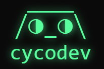

# Content Authoring Guidelines

This guide covers best practices for writing documentation for the CYCODEV website, as well as the Markdown features available to you.

## Markdown Basics

The CYCODEV documentation uses Markdown, a lightweight markup language with plain text formatting syntax. Here are some basics:

```markdown
# Heading 1
## Heading 2
### Heading 3

**Bold text**
*Italic text*
`Inline code`

[Link text](https://example.com)


- Bullet
- List
- Items

1. Numbered
2. List
3. Items

> Blockquote
```

## Extended Markdown Features

Thanks to the extensions configured in `mkdocs.yml`, you have access to enhanced Markdown features:

### Code Blocks with Syntax Highlighting

````markdown
```python
def hello_world():
    print("Hello, world!")
```
````

This renders as:

```python
def hello_world():
    print("Hello, world!")
```

### Tabbed Content

```markdown
=== "Tab 1"
    Content for tab 1

=== "Tab 2"
    Content for tab 2
```

### Admonitions (Callouts)

```markdown
!!! note "Optional Title"
    This is a note admonition.

!!! tip
    This is a tip.

!!! warning
    This is a warning.

!!! danger
    This is a danger callout.
```

These render as colored callout boxes in the documentation.

### Content Tabs for Different Environments

```markdown
=== "Windows"
    ```cmd
    echo Hello World
    ```

=== "macOS/Linux"
    ```bash
    echo "Hello World"
    ```
```

This is especially useful for showing different commands for different operating systems.

## Documenting Multiple Tools

The CYCODEV documentation covers multiple tools in the CYCODEV suite:

- **CYCOD**: The main AI-powered CLI tool
- **CYCODMD**: The markdown processing tool
- **CYCODT**: Additional tooling (upcoming)

When writing documentation for these different tools, follow these guidelines:

### Directory Structure

Place tool-specific documentation in the appropriate directory:

- `docs/basics/` and related directories for CYCOD content
- `docs/cycodmd/basics/` and related directories for CYCODMD content

### Command Examples

When showing command examples, be clear about which tool is being used:

```markdown
### CYCOD Example

```bash
cycod "What is the weather today?"
```

### CYCODMD Example

```bash
cycodmd convert document.docx --output document.md
```
```

### Cross-Referencing Between Tools

When referring to functionality in other tools, use clear cross-references:

```markdown
You can process this output further using [CYCODMD's conversion features](../cycodmd/basics/file-conversion.md).
```

### Consistent Terminology

Maintain consistency in how you refer to each tool:

- Always use "CYCOD" (all caps) when referring to the main CLI tool
- Always use "CYCODMD" (all caps) when referring to the markdown processing tool
- Use "CYCODEV" (all caps) when referring to the entire suite of tools

### Tool-Specific Icons

When using icons, consider using tool-specific icons for clarity:

- For CYCOD: `:material-console:` or `:material-chat:`
- For CYCODMD: `:material-file-document:` or `:material-markdown:`

## Using Snippets

The CYCODEV documentation uses the pymdownx.snippets extension to include reusable content:

```markdown
--8<-- "path/to/snippet.md"
```

Snippets are stored in the `snippets/` directory and can be included in any Markdown file.

### Creating a Snippet

1. Create a Markdown file in the `snippets/` directory
2. Add your content to the file
3. Include the snippet in your documentation

For example, if you have a commonly used warning in `snippets/warnings/beta-feature.md`:

```markdown
!!! warning "Beta Feature"
    This feature is in beta and may change in future releases.
```

You can include it in multiple pages:

```markdown
# My Feature Documentation

--8<-- "warnings/beta-feature.md"

More documentation...
```

## Front Matter

At the top of each Markdown file, you can add YAML front matter to set page-specific options:

```yaml
---
title: My Page Title
icon: material/rocket-launch
hide:
  - navigation
  - toc
---

# Content starts here
```

Common front matter options:

- `title`: Sets the page title (appears in browser tab and search results)
- `icon`: Adds an icon from the icon sets
- `hide`: Controls visibility of page elements

## Images and Assets

Place images and other assets in the `docs/assets/` directory:

```markdown

```

For consistency, use relative paths to reference assets.

## Document Structure Best Practices

When creating or editing documentation:

1. **Start with a clear title**: Use a descriptive H1 heading at the top of the page
2. **Provide an introduction**: Begin with a brief overview of what the page covers
3. **Use heading hierarchy**: Structure content with H2, H3, H4 headings in logical order
4. **Keep paragraphs short**: Aim for 3-4 sentences per paragraph
5. **Use lists and tables**: Break up content into digestible chunks
6. **Include examples**: Practical examples make concepts clearer

## Writing Style Guidelines

To maintain consistency across the documentation:

- **Be concise**: Use simple, direct language
- **Use active voice**: "Click the button" instead of "The button should be clicked"
- **Address the reader**: Use "you" to speak directly to the reader
- **Be consistent with terminology**: Use the same terms throughout
- **Explain acronyms**: Define acronyms on first use
- **Link liberally**: Connect related concepts with internal links

## Testing Your Content

Before submitting changes:

1. Preview your changes using `mkdocs serve`
2. Check that all links work
3. Verify that code examples are correct and properly formatted
4. Test on both desktop and mobile views

## Next Steps

Now that you understand how to author content:

- Learn about the [site structure](site-structure.md)
- Explore the [deployment process](deployment.md)
- Check out additional [resources](resources.md) for documentation