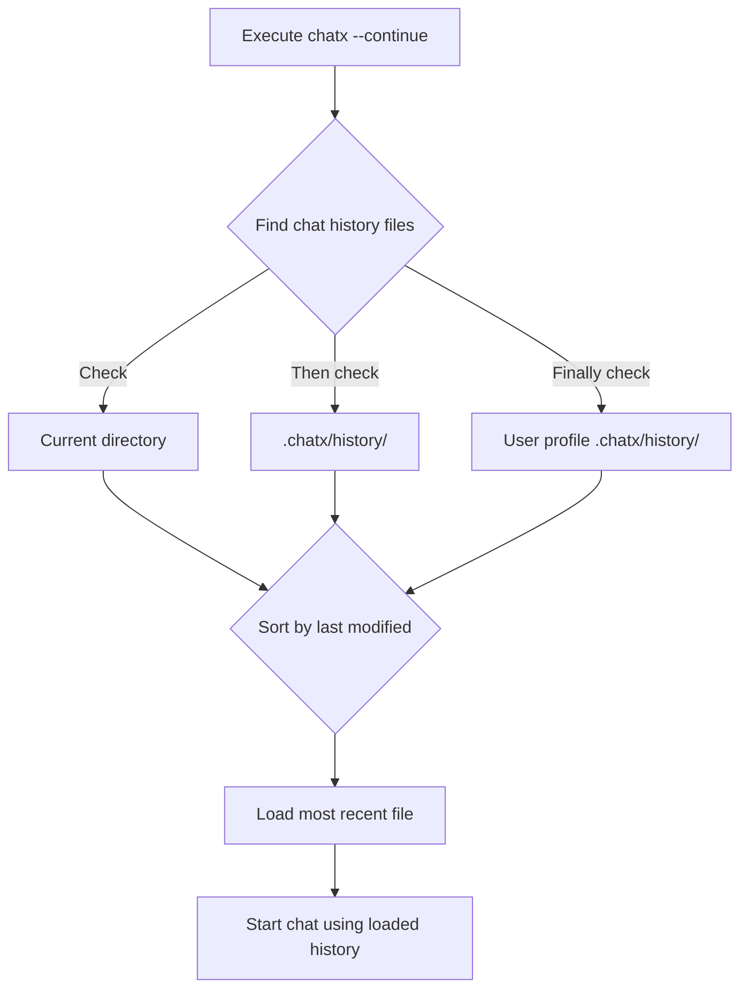

--8<-- "snippets/ai-generated.md"

## Continuing Recent Conversations

To continue your most recently saved chat history, use the `--continue` flag:

```bash title="Continue recent chat"
chatx --continue --question "What about Spain?"
```

This automatically loads the most recent chat history file without needing to specify a filename.

### How it works

When you use the `--continue` flag:

1. ChatX searches for chat history files in multiple locations (in this order):
   - Current directory (any `chat-history-*.jsonl` files)
   - Local scope history directory (`.chatx/history/`)
   - User scope history directory (`%USERPROFILE%\.chatx\history/` on Windows or `~/.chatx/history/` on Unix/Mac)

2. It finds all chat history files (including both regular and exception chat histories)
3. It sorts them by last modification time
4. It loads the most recently modified file



### Saving with `--continue`

By default, the `--continue` flag only loads the most recent history - it doesn't automatically save back to the same file. You have three options for saving when using `--continue`:

1. **Let ChatX use auto-saving** (default behavior):
   ```bash
   chatx --continue --question "Next question"
   ```
   New conversation will be saved to a new auto-generated file.

2. **Save back to the same file**:
   ```bash
   chatx --continue --output-chat-history auto --question "Next question"
   ```
   The special value `auto` tells ChatX to save back to the same file that was loaded.

3. **Save to a new specific file**:
   ```bash
   chatx --continue --output-chat-history new-branch.jsonl --question "Next question"
   ```
   This creates a "branch" of your conversation in a new file.

### Common uses for `--continue`

#### Quick follow-ups

Perfect for when you've just closed a session but have a follow-up question:

```bash title="Quick follow-up"
# First session
chatx --question "How do I create a Python virtual environment?"

# Later (after closing the first session)
chatx --continue --question "How do I activate it on Windows?"
```

#### Resuming work sessions

When you're working on a project over multiple days:

```bash title="Resume work session"
# Start a new day
chatx --continue --interactive

# Your chat history from yesterday is automatically loaded
```

#### Creating branches of conversations

You can create different "branches" of your conversations by continuing the most recent one but saving to a new file:

```bash title="Branch a conversation"
# Continue but create a new branch
chatx --continue --output-chat-history alternate-solution.jsonl --question "Let's explore a different approach"
```

#### Continuing and saving to the same file

To both continue the most recent conversation and save back to the exact same file:

```bash title="Continue and save to same file"
chatx --continue --output-chat-history auto --question "Let's keep discussing this topic"
```

The special value `auto` for `--output-chat-history` tells ChatX to save to the same file it loaded from.

#### Combining with different models

You can continue a conversation but switch to a different AI model:

```bash title="Continue with different model"
# Continue most recent conversation but use a different model
chatx --continue --use-azure-openai --question "Can you explain this differently?"
```

### Notes

- If multiple chat histories have the same modification time, ChatX selects one based on internal sorting (typically preferring files in the current directory).
- If no chat history files are found, a new conversation will start.
- The `--continue` flag is overridden if you also specify `--chat-history` or `--input-chat-history`.
- Using `--continue` with `--output-chat-history auto` will save back to the same file that was loaded.
- You can combine `--continue` with any other model options or flags like `--interactive` or `--quiet`.